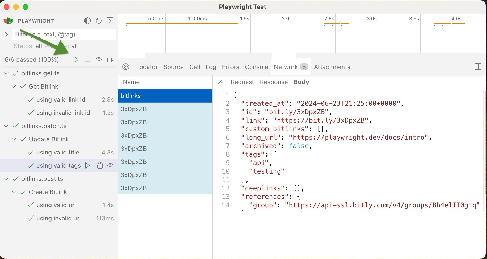

# Bitlinks API tests using Playwright

## Dev Setup

1\. Clone this repo & `cd` into root directory

2\. Create `.env` file in root directory

```bash
echo "API_URL=https://api-ssl.bitly.com\nACCESS_TOKEN=xxxxxxxxxxxxxxx" > .env
```

3\. If you have [Docker](https://docs.docker.com/engine/install/) installed then you can run tests using this command

```bash
docker compose up
```


4\. If you want to run tests locally on your machine then follow these steps

5\. Ensure [nvm](https://github.com/nvm-sh/nvm) is installed, and the correct version of nodejs used

```bash
nvm install # check .nvmrc to see the required version of node
nvm use
```

6\. Get the correct nodejs things

```bash
rm -r node_modules
nvm use
npm install
```

7\. Paste your valid API [ACCESS_TOKEN](https://app.bitly.com/settings/api) in `.env` file

8\. Run the tests

```bash
npx playwright test
```

9\. Run the tests in ✨UI Mode✨ for a better experience. You can walk through each step of the test and see each request that was made. It's pretty neat for reviewing the API request, response, & body. 

```bash
npx playwright test --ui
```

Just click the play button to kick off the tests: 
